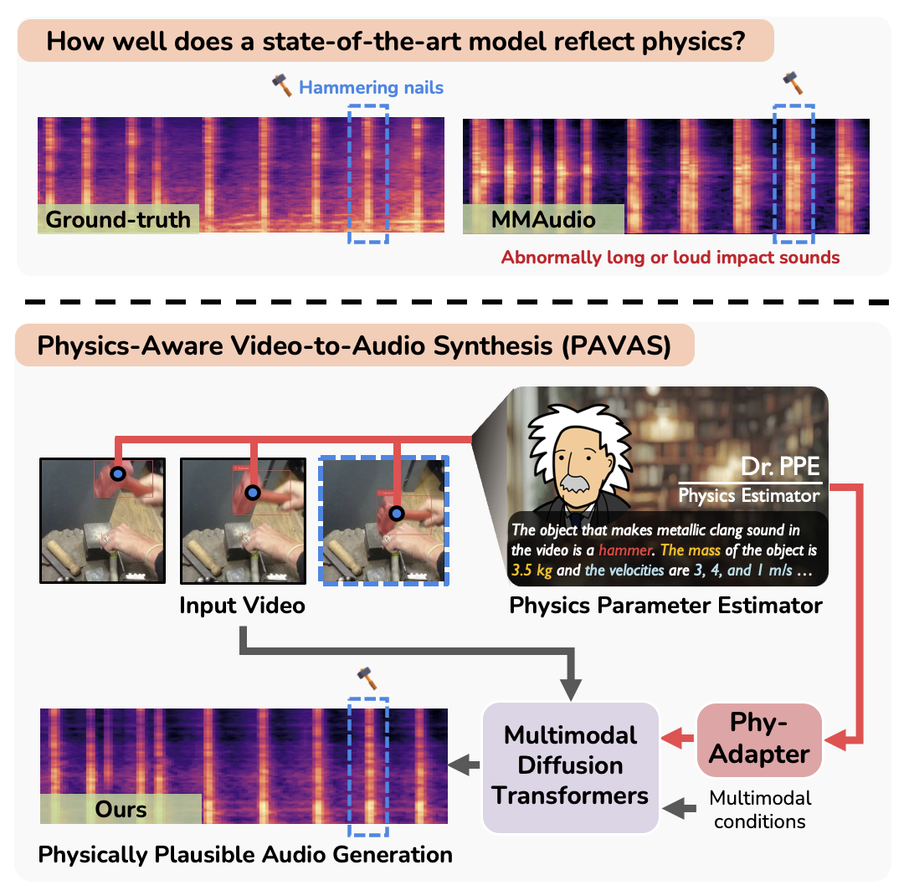

# PAVAS

## Physics-Aware Video-to-Audio Synthesis

**CVPR 2026 (Oral)**  
Oh Hyun-Bin1†, Yuhta Takida2, Toshimitsu Uesaka2, Tae-Hyun Oh4, Yuki Mitsufuji2,3

1POSTECH, 2Sony AI, 3Sony Group Corporation, 4KAIST  
†Work done during an internship at Sony AI.

  
  

PAVAS is a physics-aware video-to-audio synthesis system built on top of MMAudio. It augments the generation backbone with object-centric conditioning derived from mass, velocity, segmentation, and patch-level visual features so that generated audio better reflects the physical interactions in a video.

Code and additional assets will be released progressively.

  

## Checklists

- [x] Release Code
- [ ] Release Precomputed Results
- [ ] Release VGG-Impact and metadata
